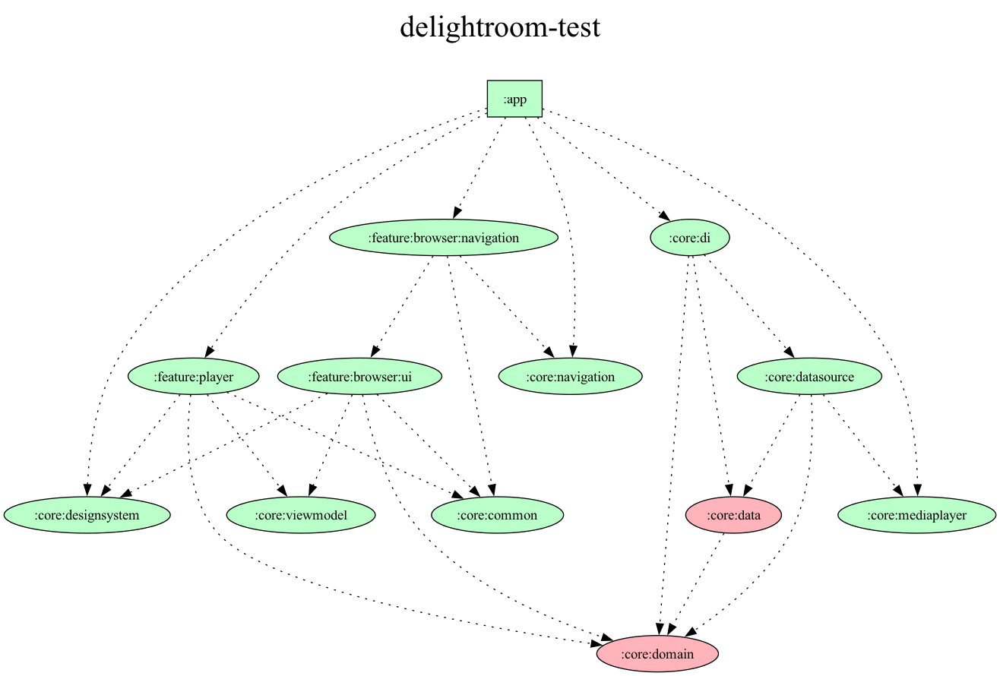

# DelightRoom 안드로이드 입사 과제 

## Requirement
간단한 음악 플레이어 앱을 만드는것이 과제입니다. 

주요 기능은 아래와 같습니다. 

- 로컬에 있는 음악을 앨범 별로 리스트 하기
- 앨범 내의 곡을 재생, 정지 등 기본적인 미디어 컨트롤 시키기
    - (백그라운드에서도 재생 및 컨트롤이 가능해야 합니다)

## 구동 영상
https://github.com/hsikkk/alarmy-test/assets/61226036/0c399d22-6f74-49eb-9d1e-9cb8071f1fb1

## 아키텍쳐
- Clean Architecture
  - Domain : UseCase, Repository
  - Data : RepositoryImpl, DataSource
  - DataSource: DataSourceImpl
- MVI

## 모듈 구조

- app
  - di 모듈 적용
  - service(player) 등록
  - 권한 선언
  - App Theme 선언
  - :feature:():navigation 모듈을 모아서 navHost 생성
  - 기타 root UI 처리
 
- core
  - domain
  - data
  - datasource
  - common : util 모음
  - navigation, viewmodel : feature 모듈에서 필요한 baseClass 및 관련 extension 제공
  - designsystem : Theme, 공통 ui 컴포넌트 제공
  - player : 실제 미디어 재생을 담당하는 player 및 service 구현체 제공
 
- feature
  - ui : 각 페이지들 구현
  - navigation : 앱 내에서 사용할 destination 선언 및 ui와 연결
      - 앱에서는 navigation 모듈만 참조(player의 경우 rootUI에 해당하므로 예외)
